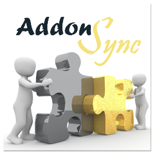

= AddonSync

There have been several requests over the years for Kodi add-ons to be able to
sync their configuration across different installations. This Kodi ervice addon,
*AddonSync*, has been built to fill that need.

It allows you to set one of your Kodi installations as the "Master" and have it
maintain a private add-on settings "repository" in some shared network folder of
your choosing, and all your other Kodi installations can install this add-on as
"Slaves" that will download and update the settings for all other add-ons to
match those the Master has shared, every time Kodi starts.

More information can be found on the
https://github.com/RogueScholar/service.addonsync/wiki[GitHub wiki].
